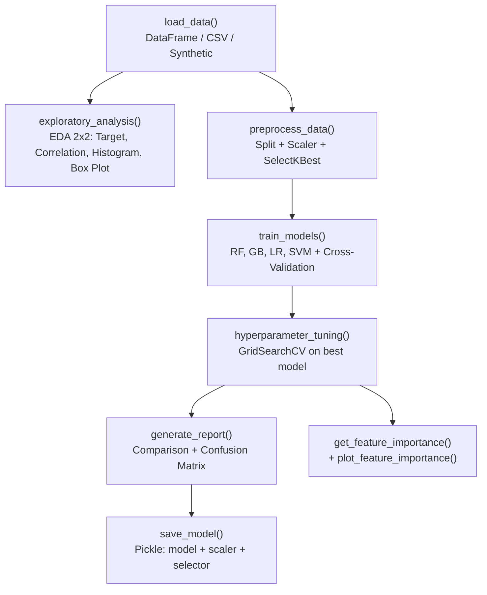

# Advanced ML Pipeline

Pipeline de Machine Learning de ponta a ponta para tarefas de classificacao, com EDA automatizada, comparacao de modelos, tuning de hiperparametros e persistencia de modelos.

[](https://python.org)
[](https://scikit-learn.org)
[](LICENSE)

[Portugues](#portugues) | [English](#english)

---

## Portugues

### Sobre

Pipeline automatizado de Machine Learning para classificacao binaria ou multiclasse. Implementado em um unico modulo Python (`ml_pipeline.py`, ~400 linhas) com a classe `MLPipeline` que:

- **EDA automatizada**: gera graficos de distribuicao do target, heatmap de correlacao, histogramas de features e box plots para deteccao de outliers
- **Pre-processamento**: split treino/teste estratificado, normalizacao com StandardScaler, selecao de features com SelectKBest (ANOVA F), features polinomiais opcionais
- **Treinamento comparativo**: treina 4 modelos (Random Forest, Gradient Boosting, Logistic Regression, SVM) com validacao cruzada k-fold
- **Tuning automatico**: GridSearchCV no melhor modelo com grids configurados em `config.py`
- **Avaliacao**: grafico comparativo de acuracia, matriz de confusao, classification report, grafico de importancia de features
- **Persistencia**: salva/carrega modelo + scaler + seletor de features via pickle

**Aviso:** Projeto educacional e de portfolio. Nao e um sistema de producao.

### Arquitetura


### Como Usar

```bash
# Clonar e instalar
git clone https://github.com/galafis/Advanced-ML-Pipeline.git
cd Advanced-ML-Pipeline
python -m venv venv
source venv/bin/activate  # Windows: venv\Scripts\activate
pip install -r requirements.txt

# Executar com dados sinteticos
python ml_pipeline.py

# Testes
pytest tests/ -v
```

### Uso Programatico

```python
from ml_pipeline import MLPipeline

# Com dados sinteticos
pipeline = MLPipeline()
results = pipeline.run_pipeline()

# Com seus proprios dados
import pandas as pd
df = pd.read_csv("meus_dados.csv")
pipeline = MLPipeline()
results = pipeline.run_pipeline(data_frame=df, target_column="target")

# Com features polinomiais
results = pipeline.run_pipeline(use_polynomial_features=True)

# Carregar modelo salvo
model_data = pipeline.load_model("best_model.pkl")
```

### Estrutura do Projeto

```
Advanced-ML-Pipeline/
├── ml_pipeline.py     # Classe MLPipeline (~400 linhas)
├── config.py          # ML_CONFIG, VISUALIZATION_CONFIG, HYPERPARAMETER_GRIDS
├── tests/
│   ├── __init__.py
│   ├── test_pipeline.py       # Teste end-to-end com verificacao de artefatos
│   ├── test_integration.py    # Teste de integracao (todas as etapas)
│   └── test_performance.py    # Teste de performance (<30s)
├── data/              # Diretorio para datasets (vazio)
├── notebooks/         # Diretorio para notebooks (vazio)
├── outputs/           # Artefatos gerados: PNGs + modelo .pkl
├── requirements.txt
├── LICENSE
└── README.md
```

### Outputs Gerados

| Arquivo | Descricao |
|---------|-----------|
| `outputs/eda_analysis.png` | EDA: distribuicao do target, correlacao, histogramas, box plots |
| `outputs/model_evaluation.png` | Comparacao de modelos + matriz de confusao |
| `outputs/feature_importance.png` | Importancia das features do melhor modelo |
| `outputs/best_model.pkl` | Modelo treinado + scaler + seletor de features |

### Tecnologias

| Tecnologia | Uso |
|------------|-----|
| **Python 3.9+** | Linguagem principal |
| **scikit-learn** | Modelos, metricas, preprocessamento, GridSearchCV |
| **pandas** | Manipulacao de dados |
| **NumPy** | Computacao numerica |
| **matplotlib** | Graficos de avaliacao |
| **seaborn** | Heatmaps e estilos |

### Limitacoes

- Suporta apenas tarefas de classificacao (nao regressao)
- Nao inclui API de servico, Dockerfile ou CI/CD
- Feature engineering limitada a selecao (SelectKBest) e features polinomiais opcionais
- Dados de exemplo sao sinteticos aleatorios
- Nao implementa validacao cruzada temporal (para dados com dependencia temporal)

---

## English

### About

Automated Machine Learning pipeline for binary or multiclass classification. Implemented in a single Python module (`ml_pipeline.py`, ~400 lines) with the `MLPipeline` class that:

- **Automated EDA**: generates target distribution, correlation heatmap, feature histograms, and box plots for outlier detection
- **Preprocessing**: stratified train/test split, StandardScaler normalization, SelectKBest (ANOVA F) feature selection, optional polynomial features
- **Comparative training**: trains 4 models (Random Forest, Gradient Boosting, Logistic Regression, SVM) with k-fold cross-validation
- **Automatic tuning**: GridSearchCV on the best model with grids configured in `config.py`
- **Evaluation**: model comparison chart, confusion matrix, classification report, feature importance plot
- **Persistence**: saves/loads model + scaler + feature selector via pickle

**Disclaimer:** Educational and portfolio project. Not a production system.

### Architecture



### Usage

```bash
# Clone and install
git clone https://github.com/galafis/Advanced-ML-Pipeline.git
cd Advanced-ML-Pipeline
python -m venv venv
source venv/bin/activate  # Windows: venv\Scripts\activate
pip install -r requirements.txt

# Run with synthetic data
python ml_pipeline.py

# Tests
pytest tests/ -v
```

### Programmatic Usage

```python
from ml_pipeline import MLPipeline

# With synthetic data
pipeline = MLPipeline()
results = pipeline.run_pipeline()

# With your own data
import pandas as pd
df = pd.read_csv("my_data.csv")
pipeline = MLPipeline()
results = pipeline.run_pipeline(data_frame=df, target_column="target")

# With polynomial features
results = pipeline.run_pipeline(use_polynomial_features=True)

# Load saved model
model_data = pipeline.load_model("best_model.pkl")
```

### Generated Outputs

| File | Description |
|------|-------------|
| `outputs/eda_analysis.png` | EDA: target distribution, correlation, histograms, box plots |
| `outputs/model_evaluation.png` | Model comparison + confusion matrix |
| `outputs/feature_importance.png` | Best model feature importance |
| `outputs/best_model.pkl` | Trained model + scaler + feature selector |

### Technologies

| Technology | Usage |
|------------|-------|
| **Python 3.9+** | Core language |
| **scikit-learn** | Models, metrics, preprocessing, GridSearchCV |
| **pandas** | Data manipulation |
| **NumPy** | Numerical computing |
| **matplotlib** | Evaluation charts |
| **seaborn** | Heatmaps and styling |

### Limitations

- Supports classification tasks only (not regression)
- Does not include a serving API, Dockerfile, or CI/CD
- Feature engineering limited to selection (SelectKBest) and optional polynomial features
- Sample data is random synthetic data
- Does not implement time-series cross-validation (for temporally dependent data)

---

## Autor / Author

**Gabriel Demetrios Lafis**
- GitHub: [@galafis](https://github.com/galafis)
- LinkedIn: [Gabriel Demetrios Lafis](https://linkedin.com/in/gabriel-demetrios-lafis)

## Licenca / License

MIT License - see [LICENSE](LICENSE).
